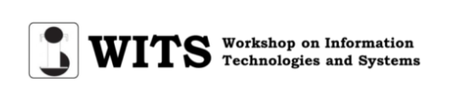

<!-- WORKSHOP BANNER -->
<br />
<div align="center">
  <a href="https://witsconf.org/">
    
  </a>
</div>

---


---

# LLMRS: Unlocking Potentials of LLM-Based Recommender Systems for Software Purchase [WITS 2023]

### [Angela John*](https://www.linkedin.com/in/angela-john/), [Theophilus Aidoo*](https://www.linkedin.com/in/theophilus-aidoo-b31319158/), [Hamayoon Behmanush*](https://www.hamayoon.me/), [Irem B. Gunduz**](https://igunduz.github.io/), [Hewan Shrestha**](https://hewanshrestha.github.io/), [Maxx Richard Rahman](https://www.linkedin.com/in/maxxrichardrahman/) and [Wolfgang Maaß](https://www.iss.uni-saarland.de/wolfgang-maass-en/)

*Equally contributing first authors \
**Equally contributing second authors

---

<!-- TABLE OF CONTENTS -->
## **Table of Contents**
1. [Project Structure](#project-structure)
2. [Pipeline](#pipeline)
3. [Installation](#installation)
4. [Running the Code](#running-the-code)
5. [Citation](#citation)
6. [License](#license)

---

## Project Structure
```
├── data
├── figures
├── output
├── src
|   ├── notebooks
|   ├── static
|   ├── web_interface
|   ├── __init__.py
|   ├── data_preprocessing.py
|   ├── logger.py
|   ├── recommendation_api.py
|   ├── software_data_processor.py
|   └── software_recommender.py
├── .gitignore 
├── LICENSE
├── README.md
└── requirements.txt
```

---

## Pipeline
The pipeline contains 3 steps as follows:
1. [Data preprocessing](https://github.com/igunduz/sofRec/blob/main/src/data_preprocessing.py)
2. [Process Software Data](https://github.com/igunduz/sofRec/blob/main/src/software_data_processor.py)
3. [Recommender](https://github.com/igunduz/sofRec/blob/main/src/notebooks/recommendation_api.py)


### Downloading data
The dataset is in *.json* format [here](https://cseweb.ucsd.edu/~jmcauley/datasets/amazon_v2/). After downloading *Software* reviews and metadata, we ran [this script](https://github.com/igunduz/sofRec/blob/main/src/notebooks/00_parse_and_clean_data.ipynb) to get data ready for preprocessing.

### Generating additional features
1. Licensing Fee is set to 80% of the minimum price in the software category. Llicensing fees could be similar in a particular software category and country.

2. Implementation Cost is set to 50% of the cost of the software.

3. Maintenance cost is assumed to be a monthly service so it was set to 1% of the price of the product.

### Installation
 
Setup environment
```bash
pip install --upgrade pip
```

```bash
python -m venv .llmrs
```
```bash
source .llmrs/bin/activate
```
```bash
conda deactivate
```
```bash
pip install -r requirements.txt
```

## Note: All monetary values are in USD($) * 100

## Running the Code

To run recommendation:

1. Run ```python src/recommendation_api.py```

2. Visit ``` 127.0.0.1:500 ```

    a. Enter Software description with price, license, maintenace and implementation costs in the respective boxes.

    b. When you click `Get Recommendation`, this would load pre-processed `data/softwares_with_scores.csv` and compute similarity with input software specification from user input.

    c. Output is then ranked with our ranking algorithm and parsed to the web interface


**Sample Input**:\
"Software for managing employee files"\
price = 0,10\
license cost = 0, 10\
maintenance cost = 0, 10\
implementation cost= 0, 10

## Citation

If you're using LLMRS in your research or applications, please cite using this BibTeX:
```
@misc{john2024llmrsunlockingpotentialsllmbased,
      title={LLMRS: Unlocking Potentials of LLM-Based Recommender Systems for Software Purchase}, 
      author={Angela John and Theophilus Aidoo and Hamayoon Behmanush and Irem B. Gunduz and Hewan Shrestha and Maxx Richard Rahman and Wolfgang Maaß},
      year={2024},
      eprint={2401.06676},
      archivePrefix={arXiv},
      primaryClass={cs.IR},
      url={https://arxiv.org/abs/2401.06676}, 
}
```

## License

[](https://www.gnu.org/licenses/gpl-3.0)\
This work is licensed under a [GNU General Public License v3](https://www.gnu.org/licenses/gpl-3.0).

<!-- UNIVERSITY BANNER -->
<br />
<div align="center">
    
</div>